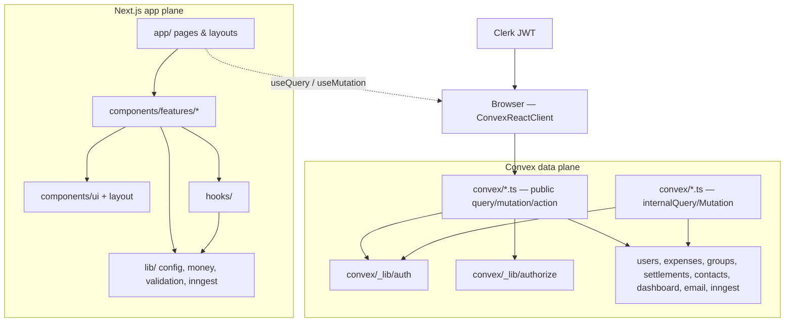

# Splittaa — Architecture

High-level structure for the Next.js app plane and Convex data plane. Enforced over time via TypeScript strict mode, ESLint boundaries, and CI (Phase 3+).

Design reference: [docs/superpowers/specs/2026-06-01-splittaa-harness-design.md](docs/superpowers/specs/2026-06-01-splittaa-harness-design.md)

---

## Two planes

**Data flow:** Clerk authenticates the browser → Convex client sends JWT → public functions call `requireAuth()` → domain logic uses `ctx.db` with indexes → safe DTOs return to React islands.

**Cross-plane rule:** Application code never imports `convex/_lib/*` or `internal.*`. Only generated `api` from `convex/_generated/api`.

---

## Convex domains

| Module | Responsibility |
|--------|----------------|
| `users` | Provision user (`store`), public `me` DTO, `searchUsers` |
| `expenses` | Create/list/delete expenses, splits, participants |
| `groups` | Groups, membership, group balances and expenses |
| `settlements` | Record payments between users (person/group) |
| `contacts` | Contact list, invites, group creation from contacts |
| `dashboard` | Balances, groups summary, spending aggregates |
| `email` | Outbound email (Resend) — authz under review |
| `inngest` + `inngestBridge` | Internal queries for jobs; public actions gated by `INNGEST_CONVEX_SECRET` |
| `seed` | Dev fixtures — must stay internal + guarded |
| `_lib/auth` | `requireAuth`, internal `getCurrentUser` |
| `_lib/authorize` | IDOR helpers (human-owned, Phase 3) |
| `_lib/errors` | Structured `ConvexError` codes (Phase 3) |

---

## Next.js structure (current → target)

| Area | Today | Target (Phase 2–3) |
|------|--------|---------------------|
| Pages | `app/(main)/*`, `app/(auth)/*` | Server shells where possible |
| Feature UI | Mixed under `app/**/components/` and `components/` | `components/features/{expenses,groups,...}` |
| Primitives | shadcn in `components/ui/` | Unchanged |
| Shared logic | `lib/utils.js`, categories | `lib/money/`, `lib/validation/`, `lib/config/env.ts` |

**Rendering:** `/` may be a Server Component; `(main)/*` uses a client layout with feature islands. Forms stay client-side (`react-hook-form` + Convex mutations).

---

## Import rules

| From | Must not import |
|------|-----------------|
| `convex/**` | `app/`, `components/`, anything under Next |
| `app/**` | `convex/_lib/`, `internal` API paths |
| `components/ui/**` | `components/features/`, `convex`, `app` |
| `lib/**` | `app/`, `components/features/` (lib is leaf) |
| `components/features/**` | Other features’ internals (prefer shared `lib/` or small shared hooks) |

**Money:** All currency/split arithmetic → `lib/money/` only (unit tested). Convex stores amounts; validates shape, not business math duplication.

---

## Security architecture (summary)

- **Identity:** Clerk → Convex `ctx.auth.getUserIdentity()`.
- **Session user row:** `internal._lib.auth.getCurrentUser` after `requireAuth`.
- **Public surface:** `users.me` returns `{ id, name, imageUrl }` only — no raw `users` table leaks.
- **Background jobs:** Inngest calls `inngestBridge` actions with shared secret; handlers delegate to `internal.inngest.*`.

Details: `docs/CONVEX.md`, future `docs/SECURITY.md`.

---

## Related docs

- Agent map: [AGENTS.md](AGENTS.md)
- Frontend patterns: [docs/FRONTEND.md](docs/FRONTEND.md)
- Convex patterns: [docs/CONVEX.md](docs/CONVEX.md)
