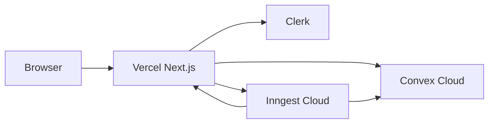

# Deployment (Vercel + Convex + Clerk)

Production hosting for the Next.js app on **Vercel**, with **Convex** as the backend and **Clerk** for auth. Optional **Inngest** cron runs through `/api/inngest` on the same Vercel project.

---

## Architecture



| Component | Host | Notes |
|-----------|------|--------|
| Next.js 15 app | Vercel | `npm run vercel-build` deploys Convex then builds Next |
| Convex functions | Convex Cloud | Pushed during Vercel build via `CONVEX_DEPLOY_KEY` |
| Clerk sessions | Clerk | JWT validated by Convex (`convex/auth.config.ts`) |
| Background jobs | Inngest → Vercel `/api/inngest` | Sync URL must match production domain |

---

## Prerequisites

1. [Vercel](https://vercel.com) account linked to your Git repo
2. [Convex](https://convex.dev) project (prod deployment)
3. [Clerk](https://clerk.com) application (production instance)
4. Optional: [Inngest](https://www.inngest.com) app for reminders / insights

---

## 1. Convex production

1. Create or select a **production** deployment in the Convex dashboard.
2. Generate a **Deploy Key** (Settings → Deploy keys).
3. Set Convex **environment variables** (dashboard → Settings → Environment variables):

| Variable | Value |
|----------|--------|
| `CLERK_JWT_ISSUER_DOMAIN` | Clerk JWT issuer URL (e.g. `https://your-app.clerk.accounts.dev`) |
| `INNGEST_CONVEX_SECRET` | Random secret (same value as on Vercel) |
| `RESEND_API_KEY` | Resend API key (if using email actions) |
| `ALLOW_DEV_SEED` | `false` in production (omit or explicit `false`) |

4. Configure Clerk auth in Convex per [Clerk + Convex](https://docs.convex.dev/auth/clerk) — issuer must match `convex/auth.config.ts`.

Manual deploy (without Vercel):

```bash
npx convex deploy
```

---

## 2. Vercel project

### Import repository

1. Vercel → **Add New Project** → import this repo.
2. Framework preset: **Next.js** (auto-detected).
3. Root directory: `.` (default).

### Build settings

The repo includes [`vercel.json`](../vercel.json):

| Setting | Value |
|---------|--------|
| Install | `npm ci` (uses `.npmrc` `legacy-peer-deps`) |
| Build | `npm run vercel-build` |

`vercel-build` runs:

```bash
npx convex deploy --cmd 'npm run build' --cmd-url-env-var-name NEXT_PUBLIC_CONVEX_URL
```

Convex deploys backend code, injects `NEXT_PUBLIC_CONVEX_URL` for the Next build, then runs `next build`.

### Required Vercel environment variables

Set for **Production** (and **Preview** if you want preview deploys to work end-to-end).

| Variable | Where used | Notes |
|----------|------------|--------|
| `CONVEX_DEPLOY_KEY` | Build (`vercel-build`) | Convex deploy key — **not** exposed to browser |
| `NEXT_PUBLIC_CONVEX_URL` | Client | Set automatically by `convex deploy` during build; do not override unless debugging |
| `NEXT_PUBLIC_CLERK_PUBLISHABLE_KEY` | Client | Clerk dashboard |
| `CLERK_SECRET_KEY` | Server | Clerk dashboard |
| `CLERK_JWT_ISSUER_DOMAIN` | Convex + docs | Must match Clerk JWT template for Convex |
| `NEXT_PUBLIC_CLERK_SIGN_IN_URL` | Client | `/sign-in` |
| `NEXT_PUBLIC_CLERK_SIGN_UP_URL` | Client | `/sign-up` |
| `NEXT_PUBLIC_APP_URL` | Optional | Canonical URL, e.g. `https://splittaa.vercel.app` — see [site URL](#site-url) |
| `INNGEST_SIGNING_KEY` | `/api/inngest` | Inngest dashboard |
| `INNGEST_EVENT_KEY` | Inngest SDK | If sending events from app |
| `INNGEST_CONVEX_SECRET` | Server + Convex | Must match Convex env |
| `RESEND_API_KEY` | Inngest jobs on Vercel | Server-only |
| `GEMINI_API_KEY` | Optional insights | Server-only |

Vercel auto-injects `VERCEL_URL` (hostname only). `lib/config/site-url.ts` builds `https://${VERCEL_URL}` when `NEXT_PUBLIC_APP_URL` is unset.

### Site URL

For production, set **`NEXT_PUBLIC_APP_URL`** to your custom domain (no trailing slash):

```bash
NEXT_PUBLIC_APP_URL=https://splittaa.fi
```

Use this in Clerk **allowed redirect URLs** and Inngest **app URL** / sync endpoint:

```text
https://<your-domain>/api/inngest
```

---

## 3. Clerk on Vercel

In Clerk dashboard → **Domains**:

1. Add your Vercel production domain (and `*.vercel.app` for previews if needed).
2. Add redirect URLs:
   - `https://<domain>/sign-in`
   - `https://<domain>/sign-up`
   - `https://<domain>/dashboard`

Ensure the **Convex** JWT template is enabled and issuer matches `CLERK_JWT_ISSUER_DOMAIN` in Convex env.

---

## 4. Inngest on Vercel

1. Create an Inngest app pointing at:
   - **Serve URL:** `https://<your-domain>/api/inngest`
2. Set `INNGEST_SIGNING_KEY` and `INNGEST_EVENT_KEY` on Vercel.
3. Set the same `INNGEST_CONVEX_SECRET` on Vercel and Convex (for `inngestBridge` / `email.sendEmail`).

The route [`app/api/inngest/route.ts`](../app/api/inngest/route.ts) uses `maxDuration: 60` for Vercel Pro limits (Hobby may cap lower).

---

## 5. Deploy checklist

- [ ] `CONVEX_DEPLOY_KEY` on Vercel (Production)
- [ ] Clerk keys + JWT issuer on Vercel and Convex
- [ ] `INNGEST_CONVEX_SECRET` matches on Vercel and Convex
- [ ] `ALLOW_DEV_SEED` not `true` in production Convex
- [ ] `npm run verify` green on `main` before merge
- [ ] First deploy: sign in on production URL, open dashboard
- [ ] Inngest: sync app and run a test function

---

## 6. Preview deployments

Preview branches get a unique `*.vercel.app` URL.

| Concern | Recommendation |
|---------|----------------|
| Clerk | Add preview URL pattern or use Clerk development keys for previews |
| Convex | Use a separate Convex **preview** deployment + preview `CONVEX_DEPLOY_KEY` |
| Inngest | Separate Inngest env or disable sync on previews |

`instrumentation.ts` runs `validateEnvAtStartup()` in production — preview builds use `NODE_ENV=production`, so required `NEXT_PUBLIC_*` and `CLERK_SECRET_KEY` must be set on the **Preview** environment in Vercel.

---

## 7. Troubleshooting

| Symptom | Likely cause |
|---------|----------------|
| Build fails: missing env | Add Production/Preview vars; see `lib/config/env.ts` |
| Convex deploy fails | Invalid or missing `CONVEX_DEPLOY_KEY` |
| Auth works locally, not on Vercel | Clerk domain / JWT issuer mismatch |
| Inngest not receiving events | Wrong serve URL; signing key mismatch |
| CSP console warnings | Tighten `next.config.ts` CSP after smoke test (report-only today) |

---

## Related

- [RELIABILITY.md](./RELIABILITY.md) — local dev, CI
- [SECURITY.md](./SECURITY.md) — secrets matrix
- [CONVEX.md](./CONVEX.md) — backend conventions
- [`.env.example`](../.env.example) — variable list
